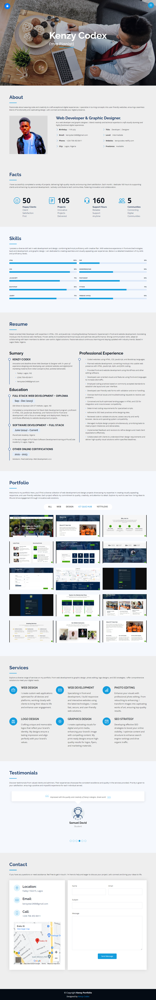

# KenFolio

Welcome to KenFolio website! This project showcases my skills and services in web design, web development, photo editing, graphics design and SEO strategy.

## Table of Contents

- [Overview](#overview)
- [Features](#features)
- [Technologies Used](#technologies-used)
- [Installation](#installation)
- [Usage](#usage)
- [Contact](#contact)
- [License](#license)
- [Acknowledgments](#acknowledgments)

## Overview

### Screenshot

### Screenshot


[Download Kenfolio PDF](./assets/files/kenfolio.pdf)

### Links

- [Live Site URL](https://kenzycodex.github.io/kenfolio/)

This portfolio is designed to highlight my expertise and provide a seamless way for potential clients to view some of my old works/projects and get in touch. The website features detailed sections on my services, client testimonials, and a contact form.

## Features

- **Responsive Design:** Works on all devices (desktops, tablets, smartphones).
- **Service Descriptions:** Detailed information about the services I offer.
- **Client Testimonials:** Feedback from satisfied clients.
- **Contact Form:** Easy-to-use form for visitors to send messages.
- **Google Maps Integration:** Displays my live location.

## Technologies Used

- HTML5 & CSS3
- Bootstrap
- JavaScript
- AOS (Animate On Scroll)
- Swiper.js
- Firebase (for contact form handling)
- Google Maps Embed API

## Installation

To run this project locally:

1. **Clone the repository:**
   ```sh
   git clone https://github.com/kenzycodex/kenfolio.git
   ```

2. **Navigate to the project directory:**
   ```sh
   cd kenfolio
   ```

3. **Open `index.html` in your web browser:**
   ```sh
   open index.html
   ```

## Usage

- **Explore Services:** Browse the "Services" section for detailed descriptions.
- **Read Testimonials:** View client feedback in the "Testimonials" section.
- **Contact Me:** Use the contact form in the "Contact" section to get in touch.

## Contact

If you have any questions or need further assistance, feel free to reach out:

- **Email:** [kenzystar2468@gmail.com](mailto:kenzystar2468@gmail.com)
- **Phone:** [+234 706 453 8411](https://wa.me/2347064538411)
- **Location:** Fadeyi 102215, Lagos

## License

This project is licensed under the MIT License.

## Acknowledgments

Special thanks to all my coding mentors ❤.
